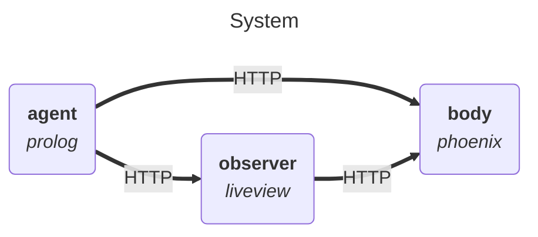
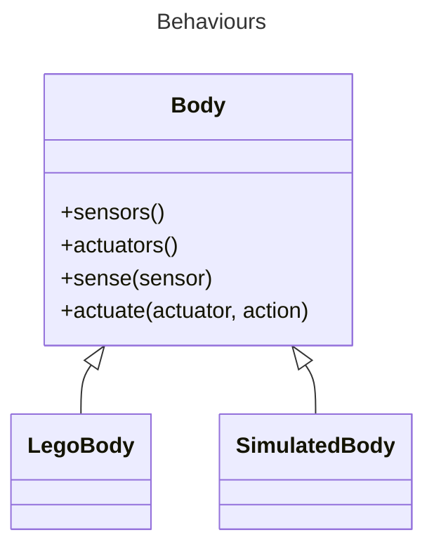
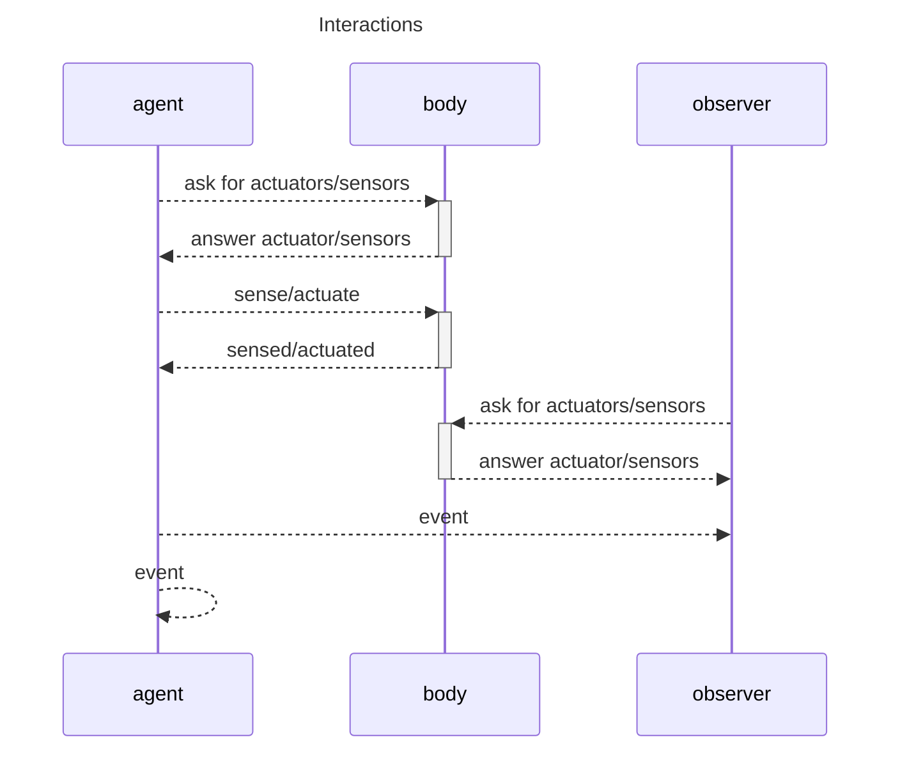

# System

## Components

* karma system
  * karma_agent (prolog)
    * Apperception
    * Fitness
    * SOM
      * Cognition actors
      * Metacognition
    * body
      * interfaces with the karma_body app
  * karma_body (elixir/phoenix)
    * Web app with API
    * Defines the BodyParts behaviour
      * list actuators and sensors
      * sense and actuate on request
    * Propagate agent events as HTTP puts
      * Events about structure and behavior
    * Accesses an implementation of BodyParts (identified via configuration)
  * karma_lego_body lib (elixir)
    * Implements the BodyParts behaviour for the BrickPi3 agent
  * karma_simulated_body lib (elixir)
    * Implements the BodyParts behaviour for a simulated agent
  * karma_observer (elixir/liveview)
    * Web app with endpoints for receiving events
    * Accesses the body app of simulated or lego agent
    * Visualization of a simulated robot's location in 2-D space
    * Monitoring of an agent's
      * Homeostatic state
      * SOM state
      * Events

## Diagrams

----

----

